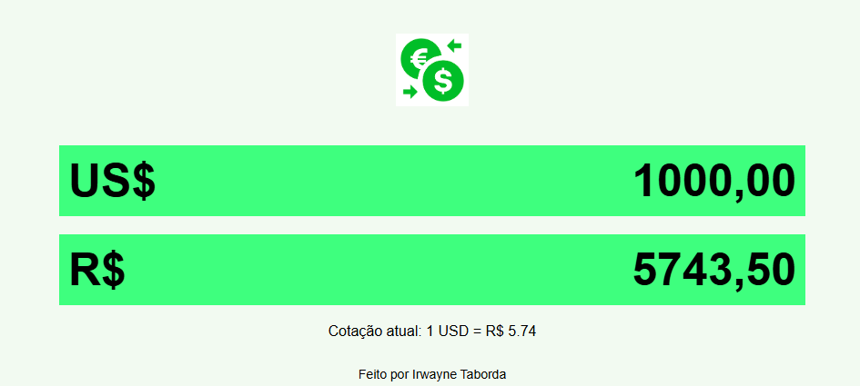

# 💱 Conversor de Moedas: Dólar para Real

Um conversor simples de Dólar (USD) para Real (BRL), desenvolvido em HTML, CSS e JavaScript.  
Atualiza a cotação do dólar automaticamente usando a API do AwesomeAPI.

## ✨ Funcionalidades

- Conversão em tempo real entre USD e BRL
- Formatação automática dos valores digitados
- Cotação atual exibida na interface
- Responsivo e leve

## 🚀 Tecnologias

- HTML5
- CSS3
- JavaScript
- API: [AwesomeAPI - Economia](https://docs.awesomeapi.com.br/api-de-moedas)

## 📷 Screenshot

 <!-- você pode substituir por uma captura de tela depois -->

## 👨‍💻 Autor

Desenvolvido por **Irwayne Taborda**
